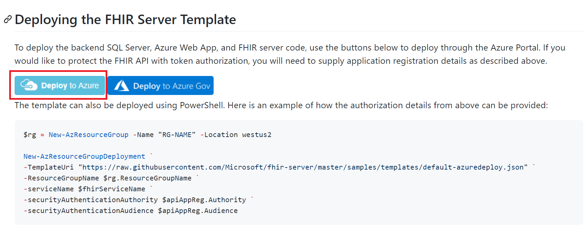

# Quickstart: Deploy Open Source FHIR server using Azure portal

In this quickstart, you'll learn how to deploy an Open Source FHIR Server in Azure using the Azure portal.

If you don't have an Azure subscription, create a [free account](https://azure.microsoft.com/free/?WT.mc_id=A261C142F) before you begin.

## GitHub Open Source repository

Navigate to the [GitHub deployment page](https://github.com/Microsoft/fhir-server/blob/master/docs/DefaultDeployment.md) and locate the "Deploy to Azure" buttons:

>

Click the deployment button and the Azure portal opens. Note that this will deploy using a custom template with a SQL Server backend. We have options to deploy using a docker image and the ability to deploy into CosmosDB. If you would like to use one of these, please find the templates [here](https://github.com/microsoft/fhir-server/tree/master/samples/templates).

## Fill in deployment parameters

You first need to set the deployment parameters. You can create a new resource group or select an existing resource group. The only other required parameters that don't have a default value filled in are a name for the service, the Sql Admin Password, and to select if SQL Schema Updats are automatically enabled.

>

Below is a table that describes all of the parameters in the custom deployment template.

|Field Name|Required?|Description|
|-|-|-|
|Subscription|**Yes**|Select the subscription where you want to deploy|
|Resource Group|**Yes**|You can create a new resource group or select an existing resource group from the selected subscription|
|Region|**Yes**|The region that you want to deploy|
|Service Name|**Yes**|Name of the FHIR Service Web App (i.e. MyFHIRServer)|
|App Service Plan Resource Group|No|Specify the exact name of your App Service Plan Resource where your App Service Plan lives or leave blank if you want to create a new one|
|App Service Plan Name|No|If you leave this blank, a new one will be created. If you want to use an existing one, you will need to specify the name exactly. Note that an App Service Plan can be either Linux or Windows. The deployment from this page creates a Windows App and so you will need a Windows App Service Plan. If you use the [Docker deployment](https://github.com/microsoft/fhir-server/blob/master/samples/templates/default-azuredeploy-docker-sql.json) you will need a Linux App Service Plan|
|Security Authenticaiton Authority|No|This is the URL to the Authority that will confirm your OAuth. If you leave this blank, authentication is disabled|
|Security Authentication Audience|No|This is the audience for your authentication|
|Enable Aad Smart on Fhir Proxy|**Yes**|Set to true to enable the [AAD Smart on FHIR Proxy](https://docs.microsoft.com/en-us/azure/healthcare-apis/use-smart-on-fhir-proxy)|
|Msdeploy Package Url|No|Webdeploy package to use as depoyment code. If blank, the latest code package will be deployed.|
|Deploy Application Insights|**Yes**|If this is set to true, it enables logging|
|Application Insights Location|**Yes**|Location for Application Insights|
|Additional Fhir Server Config Properties|No|You can specify changes to the App Settings json file. Note that you can also make these changes after deployment|
|Solution Type|**Yes**|Currently this is set to deploy SQL and cannot be changed. If you would like to deploy CosmosDB instead, you can do that [here](https://github.com/microsoft/fhir-server/blob/master/samples/templates/default-azuredeploy.json)|
|Sql Admin Password|**Yes**|This is the admin password for your SQL Server. Note that there are some password requirements that you can read about [here](https://docs.microsoft.com/en-us/sql/relational-databases/security/password-policy?view=sql-server-ver15#password-complexity)|
|Sql Location|**Yes**|This is set by default to deploy to the same region as the web application. If you set this to a different application, you will incure charges since your web application will be in one region and your server will be in another region.|
|Fhir Version|**Yes**|Select the FHIR version (STU3, R4, or R5) that you want your FHIR Server to be on.|
|Enable Export|No|Determines whether export will be enabled for this fhir instance. If true, a storage account will be created as part of the deployment. If you set this to false, you can change it to true after deployment and add the storage account value. More info on the storage setting, check [Bulk Export](https://github.com/microsoft/fhir-server/blob/master/docs/BulkExport.md). Note that you will need owner or user-administrator permissions for this. If you encounter any storage permission or role assignment related issue, a quick workaround is that you set the option to false and ask your administrator to help update the setting later.|
|Sql Schema Automatic Updates Enabled|**Yes**|Setting this to true will mean that you will automatically get schema updates. For production, we recommend setting this to false and using the [Schema Migration Tool](https://github.com/microsoft/fhir-server/blob/master/docs/SchemaMigrationGuide.md)|

After filling in the details, you can start the deployment.

## Validate FHIR Server is running

Once the deployment is complete, you can point your browser to `https://SERVICENAME.azurewebsites.net/metadata` to obtain a capability statement. It will take a minute or so for the server to respond the first time.

## Clean up resources

When no longer needed, you can delete the resource group and all related resources. To do so, select the resource group containing the provisioned resources, select **Delete resource group**, then confirm the name of the resource group to delete.
