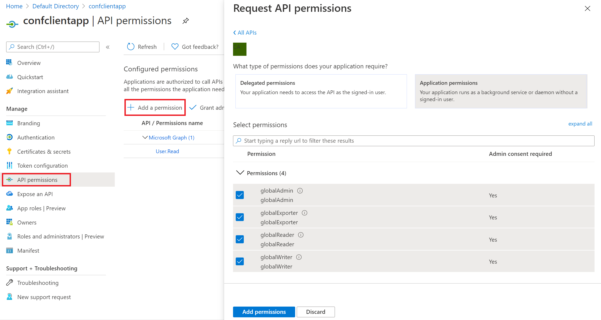

# Register client applications in the FHIR Server

In this tutorial, you'll learn how to register a confidential or public client application in Azure Active Directory. A client application registration is an Azure Active Directory representation of an application that can be used to authenticate on behalf of a user and request access to resource applications. A confidential client application is an application that can be trusted to hold a secret and present that secret when requesting access tokens. Examples of confidential applications are server-side applications. Public clients are applications such as mobile applications and single page JavaScript applications that can't keep secrets confidential. The procedure is similar to registering a confidential client, but since public clients can't be trusted to hold an application secret, there's no need to add one. There are more details on the managed service documentation about [registering applications](https://docs.microsoft.com/azure/healthcare-apis/fhir-app-registration). 

In this guide we are going to cover how to registering a confidential client and public client application differs in the open-source FHIR Server compared to the Azure API for FHIR. 

## Register a confidential client application

You can register a confidential client application following most of the steps in the [managed service tutorial](https://docs.microsoft.com/azure/healthcare-apis/register-confidential-azure-ad-client-app). The only difference is that you grant permissions by using the defined app roles that you created when you registered your [resource application](https://github.com/microsoft/fhir-server/blob/master/docs/Register-Resource-Application.md).

1. Select **API permissions** from the portal
1. Select **Add a permission**
1. Select **My APIs** to add permissions to the client app. 
1. Select appropriate role(s) for the application.

## Register a public client application

You can register a public client application as outlined in the [managed service documentation](https://docs.microsoft.com/azure/healthcare-apis/register-public-azure-ad-client-app). The only difference is granting permissions by using the defined app roles, as described above.
